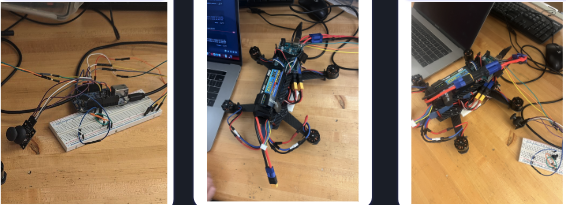
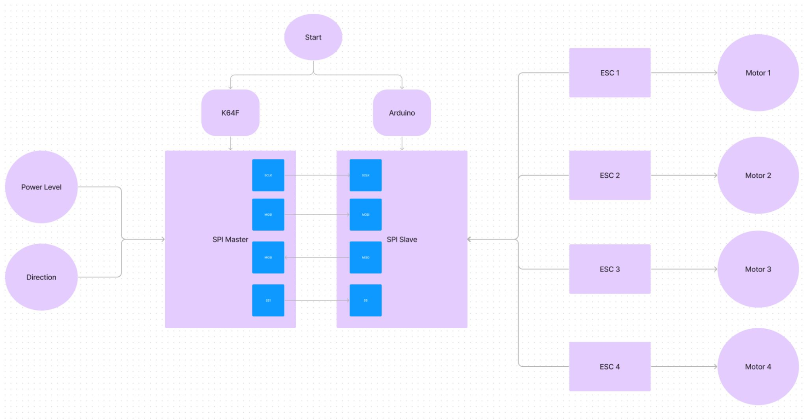
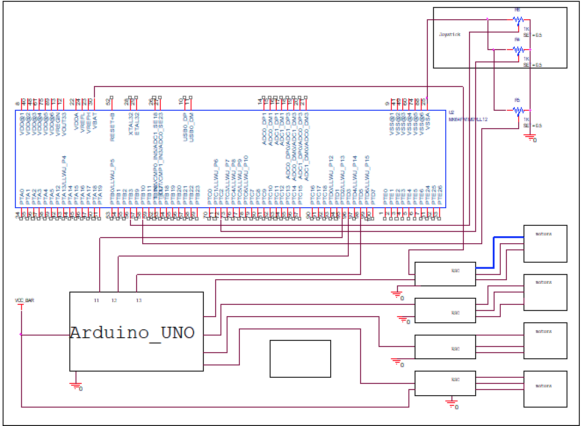
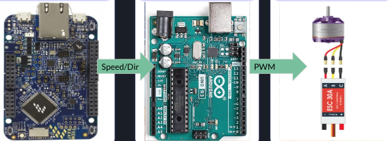

# Senior-Proj-Drone-Concept
## Project Description
Develop a drone control system using the NXP FRDM-K64F Development Board as the primary flight controller. This project will focus on generating accurate PWM control through Arduino, utilizing SPI communication between the K64F and Arduino, tracking I/O via UART, and using ADC inputs to mimic flight control.\
\

## Goals
● Utilize the K64F as a flight controller (The brain) for a  drone *concept*\
● Generate accurate PWM control through Arduino\
● Command the Arduino with K64F through SPI \
● Track I/O on laptop via K64F UART\
● Use ADC input on the K64F\
● Mimic flight control of a drone

## Implementation

## Schematic

## Hardware
● 1x NXP FRDM-K64F Development Board\
● 1x Arduino Uno R3 - receive signals from K64F and delivers that value as a pulse width to the ESC\
● 1x Joystick - control direction\
● 4x 3 phase motors - output\
● 4x 30A ESC’s - PWM to motor\
● 1x Potentiometer - control speed of motors
## Software:
● Design Studio Integrated Development Environment (IDE) \
● Arduino (IDE)
## Running the Program

<ol>
  <li>From the K64F you have control over what motors spin using the joystick. This simulates directional control. By itself with out speed control this is axis control.</li>
    <ul>
        <li>
            Pushing forward activates rear motors to spin faster than the front. for demo purposes we disabled the lower RPM motors
        </il>    
    </ul>
  <li>Turning the potentiometer will increase the speed of the motors.
    <ul>
      <li>This in tandem with the joystick will allow you to control takeoff landing and directional speed</li>
    </ul>
  </li>
  <li>You can monitor what the K64F and Arduino are transmitting and receiving. This helps with debugging and dialing what output the motors should be getting. </li>
</ol>

## Problems Encountered
### Hardware
● Power - insufficient output- batteries were necessary for higher current needs of motors and esc’s\
● # of switches - going between 5 separate switches for motor control and 2\
● Signal interference - with the 5 switch option we saw interference most likely from the loose connection in the breadboard.

### Software
● Processor Expert - trying several time to switch to PWM from the K^$F we kept dealing with necessary options not being available\
● Motor direction & speed logic - making sure the right change in the motor speeds correspond to the correct direction.\
● Capturing communication - at times the arduino would receive a signal from k64f but do nothing with it. \
● Task management - while debugging certain motors would have slight delay before matching the command

## Possible Future Implementation
### We have the mechanics of how a drone will run, but to actual have a drone on par with what you can buy out of the box we need to include several items:
● Gyroscope - angular velocity and drift\
● Accelerometer - acceleration and orientation\
● Bluetooth or radio for wireless communication and control. depending on the purpose and range needed for communication from the drone to the controller\
● Lidar - for distance detection\
● Stabilization and Hovering for stable flight\
● Simultaneous Localization And Mapping, in an automated configuration

## Contributors

* **[Joseph Spracklen](https://github.com/joesprack)**

  Helped with Arduino Programming and Hardware Design